<div align="center">


# HCoder · AI 应用生成平台

**AI 驱动的零代码应用生成平台 —— 一句话描述需求，即可生成、修改并部署一个完整网站**

基于 `Spring Boot 3` + `LangChain4j` + `LangGraph4j` + `Vue 3` 构建，覆盖「需求描述 → 智能选型 → 流式生成 → 可视化修改 → 一键部署」完整闭环。


[项目简介](#项目简介) • [核心设计](#核心设计) • [核心功能](#核心功能) • [技术架构](#技术架构) • [LangChain4j 主链路](#langchain4j-主链路详解) • [LangGraph4j 工作流](#langgraph4j-agent-工作流) • [快速开始](#快速开始) • [项目截图](#项目截图)

</div>

---

## 项目简介

HCoder 是一个 **AI 驱动的零代码应用生成平台**。用户只需用自然语言描述想要的网站，平台会自动完成：

1. **智能选型** —— AI 判断该需求适合用哪种技术方案实现（原生 HTML / 原生多文件 / Vue 工程化项目）；
2. **流式生成** —— 通过 SSE 把 AI 的回复、工具调用请求、工具执行结果实时推送给前端，生成过程全程可见；
3. **实时预览** —— 生成的代码立刻落盘并可在右侧 iframe 中预览，Vue 工程模式还会自动执行 `npm install` + `npm run build`；
4. **可视化修改** —— 在预览页点选任意元素，平台自动提取该元素的 CSS 选择器与上下文，交给 AI 做定点修改；
5. **一键部署** —— 生成 6 位 deployKey 发布到静态访问地址，并用虚拟线程异步截图上传 COS 作为应用封面；
6. **平台管理** —— 提供用户管理、应用管理、对话管理后台，支持设置精选应用并做缓存加速。

### 当前实现状态

| 能力 | 状态 | 说明 |
| --- | --- | --- |
| LangChain4j 代码生成主链路 | 已上线 | 应用对话接口 `/app/chat/gen/code` 的实际执行引擎，支撑三种生成模式 |
| LangGraph4j Agent 工作流 | 已跑通，待接入主链路 | 素材并发收集 → 提示词增强 → 智能路由 → 代码生成 → 质量检查 → 项目构建，六节点全链路已验证 |
| 工作流验证入口 | 可用 | `POST /api/workflow/execute`、`GET /api/workflow/execute-flux`，另有静态测试页 `src/main/resources/static/test-flux-workflow.html` |

> LangGraph4j 工作流是本项目下一阶段的主链路演进方向，详见 [LangGraph4j Agent 工作流](#langgraph4j-agent-工作流) 与 [Roadmap](#roadmap)。

---

## 核心设计

### 1. AI 智能选型 + 模型分层

`AiCodeGenTypeRoutingService` 使用 LangChain4j 的**结构化输出**能力，让模型直接返回 `CodeGenTypeEnum` 枚举实例，而不是返回一段需要二次解析的文本：

```java
@SystemMessage(fromResource = "prompt/codegen-routing-system-prompt.txt")
CodeGenTypeEnum routeCodeGenType(String userPrompt);
```

不同任务使用不同规格的模型，兼顾成本与效果：

| 模型 Bean | 作用域 | 用途 |
| --- | --- | --- |
| `routingChatModelPrototype` | prototype | 只做类型分类，`max-tokens` 压到 100，降低成本与首字延迟 |
| `streamingChatModelPrototype` | prototype | HTML / 多文件模式的流式生成 |
| `reasoningStreamingChatModelPrototype` | prototype | Vue 工程模式，推理模型 + 工具调用 + `temperature 0.1` 抑制幻觉 |
| `openAiChatModel` | singleton | 同步结构化输出（路由结果、代码质检结果） |

三个流式模型均声明为 `@Scope("prototype")`，配合 `AiCodeGeneratorServiceFactory` 按 `appId_codeGenType` 维度构建独立的 AiService 实例，实现多租户隔离。

### 2. 源码级扩展 LangChain4j

LangChain4j 官方的 `TokenStream` 只在**工具执行完成后**回调 `onToolExecuted`，用户无法感知「AI 正在调用哪个工具」。本项目在 `src/main/java/dev/langchain4j` 下以**同包名覆写**的方式扩展了框架内部类：

- `service/TokenStream.java`、`service/AiServiceTokenStream.java`：新增 `onPartialToolExecutionRequest` 与 `onCompleteToolExecutionRequest` 两个回调，让工具调用**请求**也能随流实时下发；
- `model/openai/OpenAiStreamingResponseBuilder.java`、`internal/ToolExecutionRequestBuilder.java`：适配流式分片场景下工具调用参数（arguments）的增量拼接；
- `service/AiServiceStreamingResponseHandler.java`：对每次工具执行加**三层防御**——① 工具执行器缺失时返回错误提示文本；② 执行异常被 try-catch 兜住并以错误信息作为结果；③ 结果为 null/blank 时替换为有意义的非空文本。

第三点是踩过坑之后的加固：只要有一个 `tool_calls` 没有对应的 `ToolExecutionResultMessage` 写回记忆，消息链就会断裂，下一次请求会被模型侧以 `insufficient tool messages following tool_calls message` 拒绝，导致整个会话不可用。

### 3. 统一的流式消息协议

AI 回复、工具调用、构建状态被抽象为四类消息，经 `JsonMessageStreamHandler` 规范化后，做到**推给前端的内容与落库到 `chat_history` 的内容完全一致**：

| 消息类型 | 触发时机 | 前端渲染方式 |
| --- | --- | --- |
| `AiResponseMessage` | 模型输出文本分片 | 追加到 Markdown 正文 |
| `ToolRequestMessage` | 模型发起工具调用请求 | 渲染「🔧 选择工具：写入文件」提示条 |
| `ToolExecutedMessage` | 工具执行完成 | 渲染「✅ 工具调用：写入文件 index.html」结果条 |
| `BuildStatusMessage` | Vue 项目构建状态变化 | 独立构建进度气泡，不并入正文 |

构建状态消息在流中带有 `@@build-status@@` 前缀，`AppController` 据此把它从正文流中剥离，路由为独立的 SSE `build-status` 事件，避免把「正在安装依赖…」这类状态文本混进 AI 回复正文和对话历史。

SSE 通道同时定义了 `done` 与 `business-error` 两个控制事件。因为接口 `Content-Type` 是 `text/event-stream`，异常无法交给全局异常处理器返回 JSON，所以流内异常统一通过 `onErrorResume` 转成 `business-error` 事件下发，前端已注册对应监听，可优雅提示并关闭连接。

### 4. 多级缓存的 AI 服务实例与对话记忆

- **本地缓存**：Caffeine 以 `appId_codeGenType` 为 key 缓存已构建的 AiService 实例，`maximumSize(1000)` + 写后 30 分钟过期 + 访问后 10 分钟过期，避免重复构建同时防止内存泄漏；
- **会话记忆**：`MessageWindowChatMemory(maxMessages = 50)` + `RedisChatMemoryStore`，按 appId 隔离；
- **记忆重建**：Redis 记忆可能过期，构建实例时会从 MySQL 回放最近 20 条对话历史重新写入记忆窗口；
- **业务缓存**：精选应用分页结果走 Spring Cache + Redis，默认缓存空间 TTL 30 分钟，`good_app_page` 单独配置 5 分钟，且只缓存前 10 页（`condition = "#appQueryRequest.pageNum <= 10"`），key 用 String 序列化、value 用带类型信息的 JSON 序列化，并禁用 null 值缓存。

### 5. 设计模式驱动的可扩展落盘链路

| 模式 | 落地位置 | 解决的问题 |
| --- | --- | --- |
| Facade | `AiCodeGeneratorFacade` | 统一封装「生成 → 解析 → 保存 → 构建」，上层只关心一个入口 |
| Factory | `AiCodeGeneratorServiceFactory`、`AiCodeGenTypeRoutingServiceFactory`、`CodeQualityCheckServiceFactory`、`ImageCollectionServiceFactory` | 按类型/租户构建 AiService 实例 |
| Strategy + Executor 分发 | `CodeParserExecutor`、`CodeFileSaverExecutor`、`StreamHandlerExecutor` | 按 `CodeGenTypeEnum` 分发到对应实现，新增生成模式只需扩展枚举与实现类 |
| Template Method | `CodeFileSaverTemplate<T>` → `HtmlCodeFileSaverTemplate` / `MultiFileCodeFileSaverTemplate` | 固化「建目录 → 写文件 → 返回路径」骨架，子类只实现 `saveFiles` |
| Prototype | 三个流式模型 Bean | 多例模型实例支撑并发会话 |
| AOP | `AuthInterceptor`（`@AuthCheck`）、`RateLimitAspect`（`@RateLimit`） | 权限校验与限流从业务代码中剥离 |

### 6. 生成 - 修改 - 部署闭环

- **可视化修改**：前端 `utils/visualEditor.ts` 向预览 iframe 注入脚本，实现 hover 高亮与点选捕获，回传 `ElementInfo`（`tagName` / `id` / `className` / `textContent` / `selector` / `pagePath` / `rect`），把精确的 CSS 选择器拼进提示词交给 AI 定点修改；
- **一键部署**：生成 6 位随机 deployKey（数据库唯一索引 `uk_deployKey` 保证不冲突），把产物复制到 `tmp/code_deploy/{deployKey}`，Vue 项目先构建再以 `dist` 作为部署源；
- **封面自动化**：部署成功后用 `Thread.startVirtualThread` 起虚拟线程，Selenium 无头浏览器截图 → 上传 COS → 回填 `app.cover`，全流程不阻塞部署接口返回；
- **删除即清理**：删除应用时先删数据库记录，再「尽力删除」生成目录与部署目录，并做路径归一化校验（必须位于受管理根目录内），防止路径异常误删其他目录。

---

## 核心功能

### 1）智能代码生成

支持三种代码生成类型，由 AI 根据需求描述自动选择，也决定了后续完全不同的解析、落盘与构建策略：

| 维度 | HTML 模式 | 多文件模式 | Vue 工程模式 |
| --- | --- | --- | --- |
| 枚举值 | `html` | `multi_file` | `vue_project` |
| 适用场景 | 单页落地页、活动页 | 结构清晰的多页静态站 | 多页面、带路由的复杂应用 |
| 产物结构 | 单个 `index.html` | `index.html` + `style.css` + `script.js` | 完整 Vite + Vue 3 工程 |
| 生成方式 | `Flux<String>` 纯文本流 | `Flux<String>` 纯文本流 | `TokenStream` + Agent 工具调用 |
| 使用模型 | `streamingChatModelPrototype` | `streamingChatModelPrototype` | `reasoningStreamingChatModelPrototype` |
| 是否需构建 | 否 | 否 | 是，`npm install` + `npm run build` |
| 落盘目录 | `tmp/code_output/html_{appId}` | `tmp/code_output/multi_file_{appId}` | `tmp/code_output/vue_project_{appId}` |
| 最大连续工具调用 | 20 | 20 | 25 |

Vue 工程模式下，AI 不再一次性吐出全部代码，而是像真实开发者一样通过工具**逐文件读写**：先 `readDir` 了解结构，再 `writeFile` 创建文件，需要调整时用 `modifyFile` 精确替换，最后 `exit` 结束工具循环。

### 2）可视化编辑

生成结果实时渲染在右侧 iframe 中。开启「编辑模式」后：

- 鼠标悬停元素实时高亮；
- 点击元素捕获完整定位信息，生成形如 `div#app > main.main-content:nth-child(2) > div.page-banner:nth-child(1) > h1:nth-child(1)` 的精确选择器；
- 前端展示「选中元素」信息卡（标签名、文本内容、所在页面路径、选择器）；
- 用户只需用自然语言说明要改成什么，AI 结合选择器上下文调用 `modifyFile` 做定点修改，而不是重新生成整个页面；
- 支持一键「退出编辑」并清理所有注入的高亮效果。

### 3）一键部署与分享

- 点击部署后同步执行构建与产物复制，立即返回可访问 URL；
- Vue 项目构建期间通过独立 SSE 事件推送 `BUILDING` / `SUCCESS` / `FAILED` 三态，前端渲染构建进度气泡，避免几十秒到几分钟的静默等待；
- 构建失败有明确兜底提示，不会让前端误以为预览已是最新效果；
- 支持下载完整项目源码 ZIP（`/app/download/{appId}`，仅创建者可下载）；
- 部署后虚拟线程异步生成封面截图并上传 COS，首页应用卡片自动展示真实产物截图。

### 4）平台管理

| 模块 | 页面 | 能力 |
| --- | --- | --- |
| 用户管理 | `/admin/userManage` | 用户列表分页、增删改查，仅管理员可见 |
| 应用管理 | `/admin/appManage` | 应用列表、封面预览、精选标记（`priority = 99` 一键切换）、编辑、删除 |
| 对话管理 | `/admin/chatManage` | 全量对话历史分页查看（消息内容、类型、应用 ID、用户 ID、时间） |
| 应用编辑 | `/app/edit/:id` | 普通用户仅可改应用名称；管理员额外可改封面与优先级；初始提示词与生成类型只读 |
| 首页精选 | `/` | 精选应用瀑布流展示，走 Redis 缓存加速 |

权限控制统一通过自定义注解 `@AuthCheck(mustRole = "admin")` + `AuthInterceptor` AOP 切面实现，业务代码零侵入。

---

## 技术架构

### 分层架构

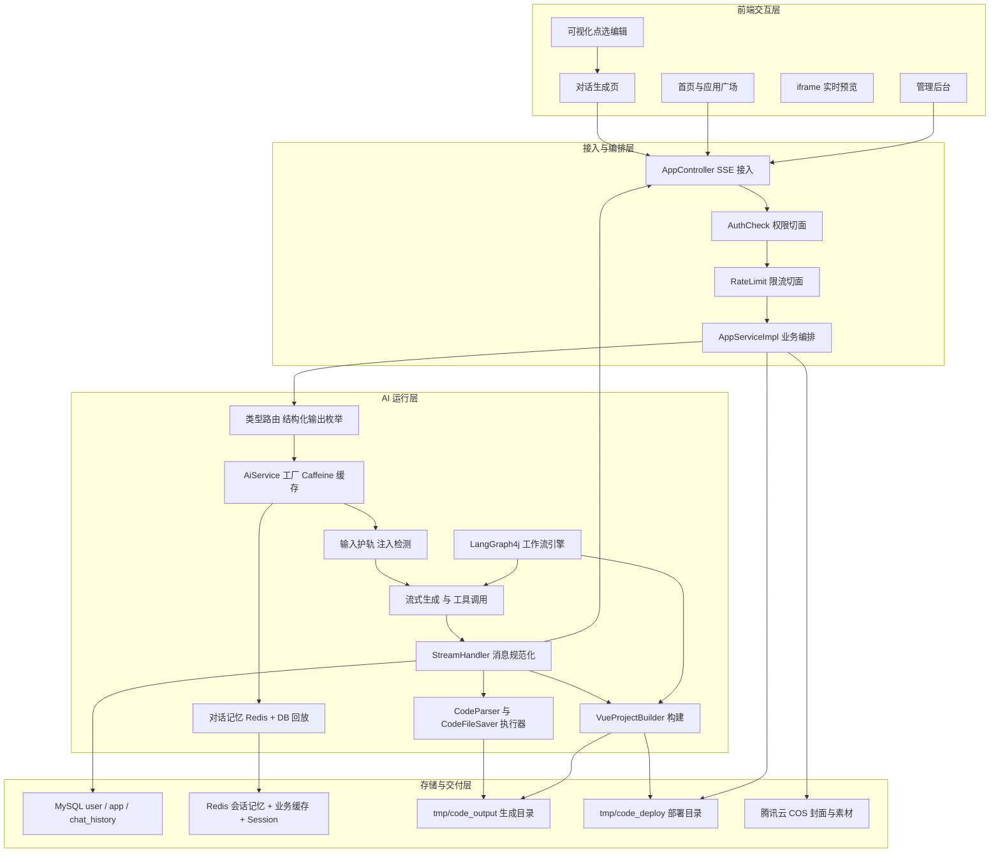

### 端到端数据流

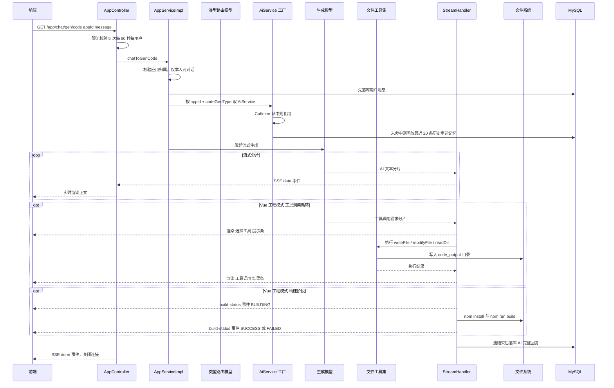

### 关键数据对象

| 对象 | 说明 |
| --- | --- |
| `appId` | 应用主键，同时作为对话记忆的 `memoryId`，实现按应用隔离多租户记忆 |
| `codeGenType` | 生成类型，决定解析器、保存器、流处理器、模型的完整分支 |
| `deployKey` | 6 位随机字符串，数据库唯一索引，部署目录名与访问路径 |
| `chat_history` | 对话历史表，`message` 用 `mediumtext` 存储（AI 完整回复含工具输出可能超过 `text` 的 64KB 上限） |
| `@@build-status@@` | 构建状态消息在流中的标识前缀，供控制器剥离为独立 SSE 事件 |

---

## 技术栈

### 后端

| 技术 | 版本 | 用途 |
| --- | --- | --- |
| Java | 21 | 开发语言，用到虚拟线程、switch 模式匹配、Record 等特性 |
| Spring Boot | 3.5.4 | 基础框架 |
| Spring Web / AOP | - | REST 接口、SSE 流式响应、切面 |
| Spring Session Data Redis | - | 分布式 Session，30 天过期 |
| MyBatis-Flex | 1.11.0 | 数据访问层，`QueryWrapper` 动态查询 + 分页 |
| MyBatis-Flex Codegen | 1.11.0 | 实体与 Mapper 代码生成 |
| HikariCP | - | 数据库连接池 |
| MySQL Connector/J | - | 数据库驱动 |
| Redisson | 3.50.0 | 分布式限流器 `RRateLimiter` |
| Caffeine | - | AI 服务实例本地缓存 |
| Knife4j | 4.4.0 | OpenAPI 3 接口文档 UI |
| Hutool | 5.8.38 | 工具库（JSON、文件、HTTP、随机串） |
| Selenium + WebDriverManager | 4.33.0 / 6.3.4 | 部署后网页截图 |
| 腾讯云 COS SDK | 5.6.227 | 封面图与生成素材对象存储 |
| DashScope SDK | 2.22.2 | 阿里云百炼文生图 |
| Lombok | 1.18.36 | 简化 POJO |

### AI 框架

| 技术 | 版本 | 用途 |
| --- | --- | --- |
| LangChain4j | 1.1.0 | AiService 声明式接口、工具调用、结构化输出、输入护轨 |
| langchain4j-open-ai-spring-boot-starter | 1.1.0-beta7 | OpenAI 兼容协议模型接入 |
| langchain4j-reactor | 1.1.0-beta7 | `Flux<String>` 流式响应支持 |
| langchain4j-community-redis | 1.1.0-beta7 | `RedisChatMemoryStore` 会话记忆持久化 |
| LangGraph4j | 1.6.0-rc2 | 有状态图工作流编排、条件边、节点流式输出 |
| 源码覆写层 | - | `src/main/java/dev/langchain4j`，扩展工具调用请求的流式回调 |

### 前端

| 技术 | 版本 | 用途 |
| --- | --- | --- |
| Vue | 3.5 | 组合式 API |
| Vite | 7 | 构建与开发服务器，端口 8235，`/api` 代理到后端 8234 |
| TypeScript | 5.8 | 类型安全 |
| Pinia | 3 | 登录用户状态管理 |
| Vue Router | 4 | 路由，含管理员权限路由 |
| Ant Design Vue | 4.2 | UI 组件库 |
| Axios | 1.11 | HTTP 请求，统一拦截器与错误提示 |
| markdown-it + highlight.js | 14 / 11 | AI 回复 Markdown 渲染与代码高亮 |
| @umijs/openapi | 1.13 | 由后端 OpenAPI 文档自动生成 `src/api` 接口与类型 |
| ESLint + Prettier | 9 / 3.5 | 代码规范 |

---

## LangChain4j 主链路详解

这是当前线上实际运行的代码生成链路，入口为 `GET /app/chat/gen/code`。

### 完整调用链

```
AppController.chatToGenCode            SSE 接入、限流、异常转 business-error 事件
  └─ AppServiceImpl.chatToGenCode      参数校验 → 应用归属校验 → 用户消息先落库
      └─ AiCodeGeneratorFacade         按 codeGenType 分发
          └─ AiCodeGeneratorServiceFactory   取/建 AiService 实例（Caffeine + Redis 记忆 + DB 回放）
              └─ AiCodeGeneratorService      声明式 AiService，@SystemMessage 从 resources/prompt 加载
                  ├─ HTML / MULTI_FILE → Flux<String> 纯文本流 → CodeParserExecutor → CodeFileSaverExecutor
                  └─ VUE_PROJECT      → TokenStream + 工具调用 → 逐文件写盘 → VueProjectBuilder 构建
      └─ StreamHandlerExecutor         按类型选择流处理器，统一规范化 + 落库
          ├─ SimpleTextStreamHandler   HTML / 多文件
          └─ JsonMessageStreamHandler  Vue 工程（含工具调用与构建状态）
```

### 提示词工程

系统提示词全部外置在 `src/main/resources/prompt/`，通过 `@SystemMessage(fromResource = "...")` 加载，调优提示词无需改动 Java 代码：

| 提示词文件 | 用途 |
| --- | --- |
| `codegen-routing-system-prompt.txt` | 代码生成类型路由判断 |
| `codegen-html-system-prompt.txt` | HTML 单文件模式生成 |
| `codegen-multi-file-system-prompt.txt` | 多文件模式生成 |
| `codegen-vue-project-system-prompt.txt` | Vue 工程模式生成，含开发约束（如要求 import 名称必须与 export 完全一致，降低构建失败率） |
| `code-quality-check-system-prompt.txt` | 工作流代码质检 |
| `image-collection-plan-system-prompt.txt` | 工作流素材收集计划 |
| `image-collection-system-prompt.txt` | 工作流素材收集执行 |

### Agent 工具清单

所有工具继承抽象基类 `BaseTool`，由 `ToolManager` 在 `@PostConstruct` 阶段自动收集全部 Bean 并建立「工具名 → 实例」映射。基类除了暴露 `@Tool` 方法，还定义了 `generateToolRequestResponse` / `generateToolExecutedResult` 两个模板方法，专门用于生成**给前端展示的友好文案**——这样流处理器无需硬编码任何工具名即可渲染工具调用过程。

| 工具方法 | 展示名 | 模型看到的描述 |
| --- | --- | --- |
| `readDir` | 读取目录 | 读取目录结构，获取指定目录下的所有文件和子目录信息 |
| `readFile` | 读取文件 | 读取指定路径的文件内容 |
| `writeFile` | 写入文件 | 写入文件到指定路径 |
| `modifyFile` | 修改文件 | 修改文件内容，用新内容替换指定的旧内容 |
| `deleteFile` | 删除文件 | 删除指定路径的文件 |
| `exit` | 退出工具调用 | 当任务已完成或无需继续调用工具时，使用此工具退出操作，防止循环 |

工具调用的稳定性保障：

- `maxSequentialToolsInvocations`：Vue 工程模式 25 次、HTML / 多文件模式 20 次，防止无限工具循环；
- `hallucinatedToolNameStrategy`：模型幻觉出不存在的工具名时，返回一条错误 `ToolExecutionResultMessage` 而不是直接抛异常中断流；
- `ExitTool`：显式给模型一个「收尾」出口，返回「不要继续调用工具，可以输出最终结果了」。

### 输入护轨

`PromptSafetyInputGuardrail` 实现 LangChain4j 的 `InputGuardrail`，在请求发往模型**之前**拦截：

- **长度限制**：超过 1000 字直接 `fatal`；
- **空输入**：`fatal`；
- **敏感词**：中英文双语词表（破解 / hack / 绕过 / bypass / 越狱 / jailbreak / 忽略之前的指令 等）；
- **提示词注入**：5 条正则覆盖 `ignore previous instructions`、`forget everything above`、`pretend to be`、`system: you are`、`new instructions:` 等常见注入范式。

> 另有 `RetryOutputGuardrail` 输出护轨实现，因为流式输出场景下无法在返回前整体重试，当前在 AiService 构建时未启用。

### 分布式限流

自定义注解 `@RateLimit` + `RateLimitAspect` AOP 切面 + Redisson `RRateLimiter`：

```java
@RateLimit(limitType = RateLimitType.USER, rate = 5, rateInterval = 60,
           message = "AI 对话请求过于频繁，请稍后再试")
@GetMapping(value = "/chat/gen/code", produces = MediaType.TEXT_EVENT_STREAM_VALUE)
public Flux<ServerSentEvent<String>> chatToGenCode(...)
```

- **三种维度**：`USER`（登录用户 ID）、`IP`（客户端 IP）、`API`（类名 + 方法名），通过注解参数切换；
- **降级策略**：`USER` 维度在拿不到请求上下文或用户未登录时自动降级为 IP 限流；
- **真实 IP 解析**：依次尝试 `X-Forwarded-For` → `X-Real-IP` → `getRemoteAddr`，并处理多级代理逗号分隔的情况；
- **Key 规范**：统一前缀 `rate_limit:`，限流器设置 1 小时过期，避免脏 key 长期堆积；
- **限流类型**：`RateType.OVERALL`，即分布式全局配额而非单实例配额。

### 对话历史与游标分页

`chat_history` 表用 `message mediumtext` 存储完整消息——AI 在 Vue 工程模式下的回复包含大量工具执行输出，很容易突破 `text` 类型 64KB 的上限。

查询采用**游标分页**而非 offset 分页：以 `lastCreateTime` 为游标向前翻页，配合复合索引 `idx_appId_createTime (appId, createTime)`，在深翻页场景下性能稳定，不会随页数增长而退化。

---

## LangGraph4j Agent 工作流

> **状态说明**：本工作流已完整设计并跑通全部六个节点（含并发素材收集、质检失败回退重生成、Vue 项目构建），可通过独立接口验证；**尚未接入 `/app/chat/gen/code` 应用对话主链路**，是本项目下一阶段的架构演进方向。

相比 LangChain4j 的「单轮工具调用循环」，LangGraph4j 把整个生成过程建模为**有状态的有向图**，每个环节是独立节点、节点间通过共享上下文传递状态、关键分支用条件边控制，因此可以做到「先收集素材再生成」「质检不过自动回退重生成」这类多步 Agent 编排。

### 工作流拓扑

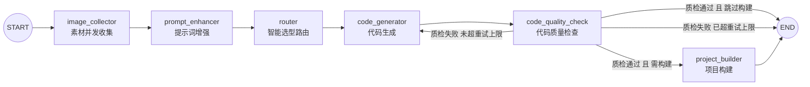

对应 `CodeGenWorkflow.createWorkflow()` 中的四条条件边：

| 条件边返回值 | 目标节点 | 触发条件 |
| --- | --- | --- |
| `build` | `project_builder` | 质检通过且生成类型为 `VUE_PROJECT` |
| `skip_build` | `END` | 质检通过且生成类型为 `HTML` / `MULTI_FILE`（无需构建） |
| `fail` | `code_generator` | 质检未通过，且重试次数 `< MAX_QUALITY_RETRY(3)` |
| `fail_end` | `END` | 质检未通过且已达重试上限，写入 `errorMessage` 后终止 |

### 节点职责与状态流转

所有节点共享同一个 `WorkflowContext`，以 `workflowContext` 为 key 存入 LangGraph4j 的 `MessagesState`，节点执行完通过 `WorkflowContext.saveContext(context)` 回写状态：

| 节点 | 读取字段 | 写入字段 | 职责 |
| --- | --- | --- | --- |
| `ImageCollectorNode` | `originalPrompt` | `imageList`、`currentStep` | 先让 AI 出收集计划，再并发执行四类素材工具 |
| `PromptEnhancerNode` | `originalPrompt`、`imageList` | `enhancedPrompt` | 把素材清单以「## 可用素材资源」段落拼进原始提示词 |
| `RouterNode` | `originalPrompt` | `generationType` | 复用 `AiCodeGenTypeRoutingService` 判型，异常兜底为 `HTML` |
| `CodeGeneratorNode` | `enhancedPrompt`、`generationType`、`qualityResult` | `generatedCodeDir` | 复用 `AiCodeGeneratorFacade` 生成并落盘；若上一轮质检失败则改用修复提示词 |
| `CodeQualityCheckNode` | `generatedCodeDir` | `qualityResult` | 汇总代码文件交 AI 质检，产出 `isValid` / `errors` / `suggestions` |
| `ProjectBuilderNode` | `generatedCodeDir` | `buildResultDir` | 复用 `VueProjectBuilder` 执行构建，成功则指向 `dist` |

> 说明：`CodeGeneratorNode` 目前使用固定 `appId = 1000L` 作为落盘目录标识（代码中已注明「后续再整合到业务中」），这是接入主链路时需要替换为真实 appId 的关键改造点。

### 素材收集：AI 出计划 + 线程池并发执行

这是工作流中最能体现 Agent 价值的一环——生成的网站不再是「灰白占位图 + Lorem ipsum」，而是带有真实配图、插画、架构图和品牌 Logo 的完整站点。

**两阶段设计**：

1. `ImageCollectionPlanService` 先根据原始提示词产出一份结构化收集计划 `ImageCollectionPlan`，内含四类任务列表：`contentImageTasks` / `illustrationTasks` / `diagramTasks` / `logoTasks`；
2. 按计划把每个任务包装成 `CompletableFuture.supplyAsync(...)` 提交到**专用线程池**并发执行，最后 `CompletableFuture.allOf(...).join()` 汇聚结果。

**四类素材工具**（均以 `@Tool` 注解声明，可被 AI 直接调用）：

| 工具 | 数据源 | 说明 |
| --- | --- | --- |
| `ImageSearchTool` | Pexels API | 搜索内容图，单次取 12 张，使用 `src.medium` 尺寸平衡清晰度与体积 |
| `UndrawIllustrationTool` | undraw.co | 搜索扁平风插画，用于网站美化装饰 |
| `MermaidDiagramTool` | Mermaid 渲染 | 把 AI 生成的 Mermaid 代码渲染为架构图图片，用于展示系统结构 |
| `LogoGeneratorTool` | 阿里云 DashScope 文生图 | 生成品牌 Logo，提示词强制「禁止包含任何文字」，尺寸 768×768 |

`LogoGeneratorTool` 里有两个生产级细节：

- **静默失败检测**：DashScope SDK 在任务失败时**不抛异常**（HTTP 仍为 200），必须主动校验 `output.taskStatus == "SUCCEEDED"`，否则会静默返回空列表；
- **临时链接转存**：DashScope 返回的图片 URL 仅 24 小时有效，工具会先下载到本地临时文件再上传腾讯云 COS 换取持久化 URL；转存失败则降级使用临时链接，且 `finally` 中清理临时文件避免磁盘堆积。

**专用线程池 `imageCollectionExecutor`**：素材收集全是长耗时 IO 型任务（HTTP 搜图、文生图、Mermaid CLI 渲染），因此与公共线程池隔离：

| 参数 | 取值 | 理由 |
| --- | --- | --- |
| 核心线程数 | 8 | IO 密集型，取较大值提高并发度 |
| 最大线程数 | 16 | 应对突发任务量 |
| 队列 | `LinkedBlockingQueue(32)` | 有界队列，防止任务无限堆积耗尽内存 |
| 拒绝策略 | `CallerRunsPolicy` | 降级由调用线程执行，保证任务不丢失 |
| 线程属性 | daemon，命名 `image-collect-N` | 不阻塞 JVM 退出，且便于日志排查 |
| 空闲回收 | 60 秒 | 非核心线程及时释放 |

### 质检闭环：让 AI 检查 AI

`CodeQualityCheckNode` 会遍历生成目录，把所有代码文件拼成「# 项目文件结构和代码内容」上下文交给 `CodeQualityCheckService` 质检：

- **纳入检查的后缀**：`.html` `.htm` `.css` `.js` `.json` `.vue` `.ts` `.jsx` `.tsx`；
- **主动跳过**：隐藏文件，以及 `node_modules` / `dist` / `target` / `.git` 目录，避免把依赖和产物喂给模型；
- **产出结构**：`QualityResult { isValid, errors, suggestions }`。

质检不通过时，`CodeGeneratorNode` 不会简单重跑，而是把 `errors` 与 `suggestions` 组装成一段**修复提示词**（「## 上次生成的代码存在以下问题，请修复」+ 错误列表 + 修复建议）作为新一轮输入，让模型带着明确的缺陷清单做定向修复。

两条防死循环兜底：

- `MAX_QUALITY_RETRY = 3`，达到上限走 `fail_end` 并写入用户可读的 `errorMessage`；
- 质检节点**自身抛异常**时返回 `isValid = true` 直接放行，避免质检服务不可用把整条工作流卡死。

### 执行与观测

`CodeGenWorkflow` 提供两种执行方式：

| 方法 | 说明 |
| --- | --- |
| `executeWorkflow(prompt)` | 阻塞执行，逐步打印每个节点完成后的上下文，返回最终 `WorkflowContext` |
| `executeWorkflowWithFlux(prompt)` | 用 `Thread.startVirtualThread` + `Flux.create` 把节点进度包装为 SSE 流，事件类型：`workflow_start` / `step_completed` / `workflow_completed` / `workflow_error` |

工作流启动时会调用 `workflow.getGraph(GraphRepresentation.Type.MERMAID)` 把图结构以 Mermaid 文本打印到日志，便于核对拓扑是否与预期一致。

**验证方式**：

```bash
# 同步执行，返回完整 WorkflowContext
curl -X POST "http://localhost:8234/api/workflow/execute?prompt=做一个个人博客网站"

# SSE 流式执行，逐步返回节点进度
curl -N "http://localhost:8234/api/workflow/execute-flux?prompt=做一个个人博客网站"
```

也可以直接在浏览器打开内置测试页 `http://localhost:8234/api/static/test-flux-workflow.html` 观察流式节点输出。单元测试见 `src/test/java/com/hlh/hlhaicodemaster/langgraph4j/CodeGenWorkflowTest.java`。

---

## 部署机制

### 目录约定

| 目录 | 命名规则 | 说明 |
| --- | --- | --- |
| 生成目录 | `tmp/code_output/{codeGenType}_{appId}` | 三种模式统一规则，如 `html_123`、`multi_file_123`、`vue_project_123` |
| 部署目录 | `tmp/code_deploy/{deployKey}` | 部署时从生成目录复制而来，Vue 项目复制的是 `dist` |
| 截图临时目录 | `tmp/screenshots/{uuid}` | Selenium 截图落地后上传 COS |

`tmp` 已在 `.gitignore` 中排除，产物不会污染仓库。

### 部署流程

```
1. 校验 appId 与应用归属（仅创建者可部署）
2. 复用已有 deployKey，没有则生成 6 位随机串（大小写字母 + 数字）
3. 定位生成目录，不存在则报「应用代码不存在，请先生成代码」
4. Vue 项目：同步执行构建 → 校验 dist 目录已生成 → 把部署源切换为 dist
5. 复制产物到 tmp/code_deploy/{deployKey}
6. 回写 deployKey 与 deployedTime
7. 返回访问 URL：{CODE_DEPLOY_HOST}/{deployKey}/
8. 虚拟线程异步：Selenium 截图 → 上传 COS → 回填 app.cover
```

第 4 步刻意采用**同步**构建而非异步：用户点击部署后需要立即拿到确定的结果，异步会让「部署成功」与「实际可访问」出现时间差。

### Vue 项目构建

`VueProjectBuilder` 负责执行 `npm install` + `npm run build`，并做了几处工程化处理：

- **改用 `ProcessBuilder` 并并发消费 stdout / stderr**：早期实现用 `RuntimeUtil.exec` 且从不读取子进程输出流，一旦输出缓冲区写满就会导致子进程阻塞，且构建失败时日志里只有一句「Vue 构建项目失败」，完全无法定位根因；
- **失败时输出完整日志**：把标准输出与错误输出全量记入日志，`npm run build` 的真实报错（如 Rollup 的 `"xxx" is not exported by "yyy"`）可以直接看到；
- **Windows 兼容**：命令使用 `npm.cmd`，输出按 GBK 解码避免中文乱码；
- **产物校验**：构建返回成功还要额外确认 `dist` 目录确实存在，否则视为失败；
- **提供异步版本**：`buildProjectAsync` 用于对话生成链路中不阻塞 SSE 的场景。

### 静态资源访问

`StaticResourceController` 暴露 `/api/static/{deployKey}/**`，用于开发期直接浏览产物：

- 目录访问（不带斜杠）自动 301 重定向到带斜杠的 URL，保证页面内相对路径正确；
- 根路径默认返回 `index.html`；
- 按扩展名返回带 `charset=UTF-8` 的 Content-Type，避免中文页面乱码。

生产环境的公网访问地址由 `AppConstant.CODE_DEPLOY_HOST` 拼接 deployKey 得到，需由 Nginx 等 Web 服务器把该路径指向 `tmp/code_deploy` 目录；若要在公网部署，修改该常量即可（也可改造为读取 `code.deploy-host` 配置项）。

### 封面自动截图

部署成功后，`ScreenshotServiceImpl` 用 Selenium 无头浏览器打开部署地址截图，压缩为 jpg 后上传 COS，对象键格式为 `/screenshots/yyyy/MM/dd/{8位uuid}_compressed.jpg`，最后回填 `app.cover`。整个过程跑在虚拟线程上，不占用平台线程也不阻塞接口返回。

---

## 项目结构

### 后端

```
src/main/java/
├── com/hlh/hlhaicodemaster/
│   ├── HlhAiCodeMasterApplication.java   启动类
│   ├── ai/                             LangChain4j AI 能力层
│   │   ├── guardrail/                  输入护轨、输出重试护轨
│   │   ├── model/                      结构化输出模型 + 四类流式消息模型
│   │   ├── tools/                      Agent 文件操作工具集 + ToolManager
│   │   ├── AiCodeGenTypeRoutingService(Factory)   生成类型智能路由
│   │   └── AiCodeGeneratorService(Factory)        代码生成服务与实例缓存工厂
│   ├── annotation/  aop/               @AuthCheck 与权限切面
│   ├── common/                         BaseResponse、ResultUtils、PageRequest、DeleteRequest
│   ├── config/                         四套模型、Redis 缓存、Redis 记忆、COS、JSON、跨域
│   ├── constant/                       AppConstant（目录规则、精选优先级、流标识）、UserConstant
│   ├── controller/                     App / User / ChatHistory / StaticResource / Workflow / Health
│   ├── core/                           代码生成核心
│   │   ├── AiCodeGeneratorFacade       门面：生成 + 解析 + 保存 + 构建
│   │   ├── builder/VueProjectBuilder   npm install 与 npm run build
│   │   ├── handler/                    流处理器执行器与两种实现
│   │   ├── parser/                     代码解析器接口、执行器、Html / MultiFile 实现
│   │   ├── saver/                      保存器模板方法、执行器、Html / MultiFile 实现
│   │   └── CodeParser / CodeFileSaver  @Deprecated 旧实现，已被 parser / saver 包取代
│   ├── exception/                      BusinessException、ErrorCode、全局异常处理、ThrowUtils
│   ├── generator/                      MyBatis-Flex 代码生成器
│   ├── langgraph4j/                    LangGraph4j 工作流（详见专章）
│   │   ├── CodeGenWorkflow.java        图定义、条件边、两种执行方式
│   │   ├── node/                       6 个业务节点
│   │   ├── state/WorkflowContext       跳节点共享状态载体
│   │   ├── ai/                         质检、素材收集、收集计划三个 AiService 及其工厂
│   │   ├── tools/                      四类素材工具
│   │   ├── model/                      ImageResource、ImageCollectionPlan、QualityResult、分类枚举
│   │   ├── config/                     素材收集专用线程池
│   │   └── demo/  workflowsamples/     LangGraph4j 入门示例，与业务无关
│   ├── manager/CosManager              对象存储上传
│   ├── mapper/                         MyBatis-Flex Mapper
│   ├── model/                          dto（按模块分包）/ entity / enums / vo
│   ├── ratelimit/                      @RateLimit 注解、AOP 切面、Redisson 配置、限流类型枚举
│   ├── service/ (+impl)                App / User / ChatHistory / Screenshot / ProjectDownload
│   └── utils/                          CacheKeyUtils、SpringContextUtil、WebScreenshotUtils
│
└── dev/langchain4j/                    源码级覆写扩展层（同包名影子 jar 内类）
    ├── internal/ToolExecutionRequestBuilder.java
    ├── model/chat/response/StreamingChatResponseHandler.java
    ├── model/openai/OpenAiStreamingChatModel.java
    ├── model/openai/OpenAiStreamingResponseBuilder.java
    └── service/TokenStream.java  AiServiceTokenStream.java  AiServiceStreamingResponseHandler.java

src/main/resources/
├── mapper/                MyBatis XML
├── prompt/                7 个系统提示词（外置，调优无需改代码）
├── static/                test-flux-workflow.html 工作流测试页
├── application.yml        主配置（端口 8234、context-path /api、MySQL、Redis、Session）
├── application-example.yml 配置模板（可入库，密钥均为占位符）
├── application-local.yml  本地配置（已 gitignore，含真实密钥）
└── application-prod.yml   生产配置（已 gitignore）
```

### 前端

```
hlh-ai-code-master-fronted/src/
├── api/                   由 openapi2ts 自动生成的接口与类型定义
├── components/            AppCard、AppDetailModal、DeploySuccessModal、MarkdownRenderer、
│                          GlobalHeader、GlobalFooter、AuthBrandPanel、BrandLogo、UserInfo
├── config/env.ts          部署域名等环境配置
├── layouts/BasicLayout.vue 全局布局 + 路由守卫
├── pages/
│   ├── HomePage.vue       首页：创建入口、快速开始模板、我的作品、精选案例
│   ├── app/AppChatPage.vue  对话生成页：流式渲染 + 工具调用轨迹 + 构建气泡 + 预览 + 可视化编辑
│   ├── app/AppEditPage.vue  应用信息编辑（按角色区分可编辑字段）
│   ├── user/              登录、注册
│   └── admin/             用户管理、应用管理、对话管理
├── router/index.ts        8 条路由
├── stores/loginUser.ts    Pinia 登录态
├── utils/
│   ├── visualEditor.ts    iframe 可视化编辑器（注入脚本、hover 高亮、点选捕获）
│   ├── codeGenTypes.ts    生成类型枚举与文案映射
│   └── time.ts            时间格式化
├── request.ts             Axios 实例与拦截器
└── access.ts              权限路由控制
```

---

## 快速开始

### 环境要求

| 依赖 | 版本 | 备注 |
| --- | --- | --- |
| JDK | 21+ | 必需，项目使用虚拟线程等 Java 21 特性 |
| Maven | 3.9+ | 已内置 Maven Wrapper，可不单独安装 |
| Node.js | 18+ | 前端开发必需；**Vue 工程模式生成也需要本地 npm** |
| MySQL | 8+ | |
| Redis | 6+ | Session、对话记忆、业务缓存、分布式限流均依赖 |
| Chrome / Chromium | 最新稳定版 | 封面截图功能需要，WebDriverManager 会自动下载驱动 |

### 1. 克隆与建库

```bash
git clone https://github.com/Damon-HLH/hlh-ai-code-master.git
cd hlh-ai-code-master
```

执行 `sql/create_table.sql` 初始化数据库，会创建 `hlh_ai_code_master` 库及 `user`、`app`、`chat_history` 三张表。

### 2. 配置密钥

```bash
# Windows
copy src\main\resources\application-example.yml src\main\resources\application-local.yml
# macOS / Linux
cp src/main/resources/application-example.yml src/main/resources/application-local.yml
```

打开 `application-local.yml`，把全部 `<YOUR_XXX>` 占位符替换为真实密钥：

| 配置项 | 是否必需 | 获取方式 |
| --- | --- | --- |
| `langchain4j.open-ai.*.api-key` | 必需 | DeepSeek / 通义 / 智谱等任意 OpenAI 兼容服务，同步修改 `base-url` 与 `model-name` |
| `spring.datasource.*` | 必需 | 在 `application.yml` 中，默认 `localhost:3306`、`root/123456` |
| `spring.data.redis.*` | 必需 | 在 `application.yml` 中，默认 `localhost:6379` 无密码 |
| `cos.client.*` | 部署封面、工作流 Logo 需要 | 腾讯云对象存储 |
| `pexels.api-key` | 工作流素材收集需要 | [Pexels API](https://www.pexels.com/api/) 免费注册（**key 不能整体缺失**，否则启动报错） |
| `dashscope.api-key` | 工作流 Logo 生成需要 | 阿里云百炼控制台 |

> `application-local.yml` 与 `application-prod.yml` 已在 `.gitignore` 中排除，请勿手动取消排除，避免密钥泄露。

### 3. 启动后端

```bash
# Windows
mvnw.cmd spring-boot:run
# macOS / Linux
./mvnw spring-boot:run
```

> **JDK 版本坑**：部分 IDE 的终端会把 `JAVA_HOME` 自动指向最新安装的 JDK（如 Java 25），导致 Lombok 不兼容而编译失败。启动前先 `java -version` 确认是 21；必要时临时 `set JAVA_HOME=<JDK21 路径>` 覆盖。

### 4. 启动前端

```bash
cd hlh-ai-code-master-fronted
npm install
npm run dev
```

前端 `.env.development` 默认配置：

```properties
VITE_API_BASE_URL=/api            # 走 Vite 代理，统一同源，避免跨域
VITE_DEPLOY_DOMAIN=http://localhost  # 部署访问域名
```

Vite 开发服务器监听 **8235**，并把 `/api` 代理到后端 **8234**。

### 5. 访问地址

| 入口 | 地址 |
| --- | --- |
| 前端页面 | http://localhost:8235 |
| 后端接口 | http://localhost:8234/api |
| 接口文档（Knife4j） | http://localhost:8234/api/doc.html |
| 工作流测试页 | http://localhost:8234/api/static/test-flux-workflow.html |

### 6. 前端接口代码自动生成

后端启动后，可根据 OpenAPI 文档重新生成 `src/api` 下的接口函数与 TypeScript 类型：

```bash
cd hlh-ai-code-master-fronted
npm run openapi2ts
```

---

## 核心接口一览

所有接口统一前缀 `/api`，返回体统一为 `BaseResponse<T>`（SSE 接口除外）。

### 应用 App

| 方法 | 路径 | 权限 | 说明 |
| --- | --- | --- | --- |
| GET | `/app/chat/gen/code` | 登录 + 限流 5次/60秒 | **核心接口**，SSE 流式对话生成代码 |
| POST | `/app/add` | 登录 | 创建应用，AI 自动判定生成类型 |
| POST | `/app/update` | 仅本人 | 修改应用名称 |
| POST | `/app/delete` | 本人或管理员 | 删除应用，并清理生成目录、部署目录、对话历史 |
| GET | `/app/get/vo` | 公开 | 应用详情（含创建者脱敏信息） |
| POST | `/app/my/list/page/vo` | 登录 | 我的应用分页，每页最多 20 条 |
| POST | `/app/good/list/page/vo` | 公开 | 精选应用分页，Redis 缓存前 10 页 |
| POST | `/app/deploy` | 仅本人 | 一键部署，返回可访问 URL |
| GET | `/app/download/{appId}` | 仅创建者 | 下载完整项目源码 ZIP |
| POST | `/app/admin/update` | admin | 管理员编辑（名称、封面、优先级） |
| POST | `/app/admin/delete` | admin | 管理员删除 |
| POST | `/app/admin/list/page/vo` | admin | 管理员全量分页 |
| GET | `/app/admin/get/vo` | admin | 管理员查详情 |

### 用户 User

| 方法 | 路径 | 权限 | 说明 |
| --- | --- | --- | --- |
| POST | `/user/register` | 公开 | 注册 |
| POST | `/user/login` | 公开 | 登录，Session 写入 Redis |
| GET | `/user/get/login` | 登录 | 获取当前登录用户 |
| POST | `/user/logout` | 登录 | 注销 |
| GET | `/user/get/vo` | 公开 | 用户脱敏信息 |
| POST | `/user/add` `/user/update` `/user/delete` `/user/list/page/vo`、GET `/user/get` | admin | 用户管理后台 |

### 对话历史 ChatHistory

| 方法 | 路径 | 权限 | 说明 |
| --- | --- | --- | --- |
| GET | `/chatHistory/app/{appId}` | 登录 | 游标分页，`pageSize` 默认 10，`lastCreateTime` 可选 |
| POST | `/chatHistory/admin/list/page/vo` | admin | 全量对话历史分页 |

### 静态资源与工作流

| 方法 | 路径 | 说明 |
| --- | --- | --- |
| GET | `/static/{deployKey}/**` | 静态资源访问，目录自动重定向，默认返回 index.html |
| GET | `/health/` | 健康检查 |
| POST | `/workflow/execute` | 同步执行 LangGraph4j 工作流，返回最终上下文 |
| GET | `/workflow/execute-flux` | SSE 流式执行工作流，逐节点返回进度 |

---

## 项目截图

### 首页

一句话描述需求即可开始创建，下方提供常用模板快速开始：

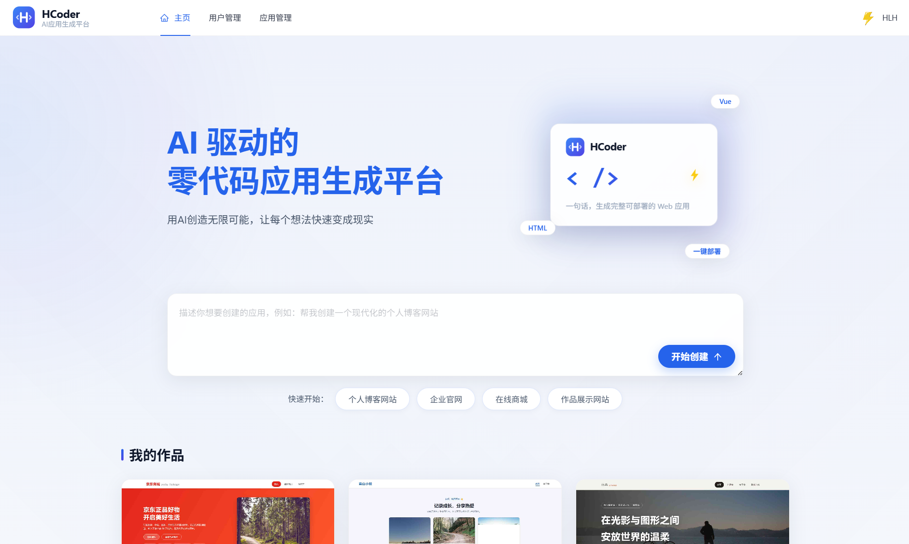

我的作品与精选案例，卡片封面均为平台真实生成产物的自动截图：

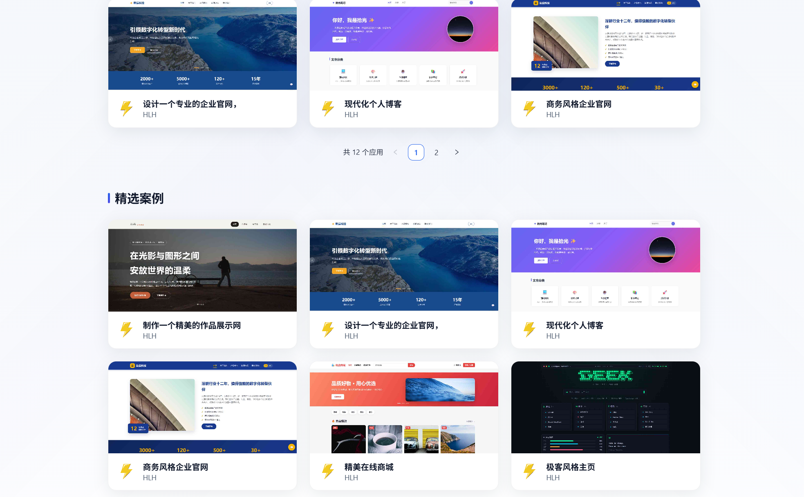

### 对话生成

左侧流式输出 AI 回复与工具调用轨迹，右侧 iframe 实时预览生成结果：

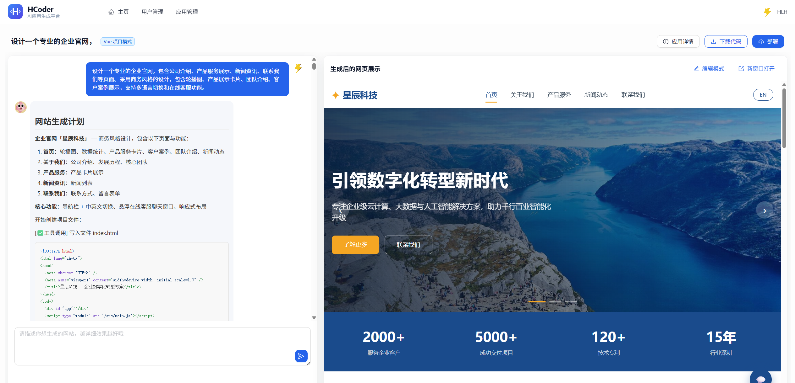

Vue 工程模式产出完整项目，下图为生成的 14 文件极客终端风浏览器主页：

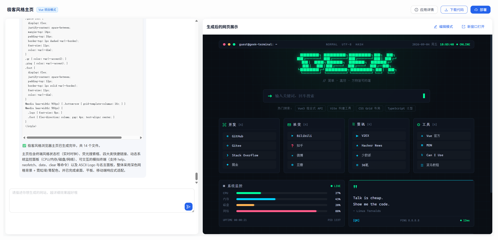

### 可视化编辑

开启编辑模式后点选元素，平台自动提取 CSS 选择器与页面路径，用自然语言即可完成定点修改：

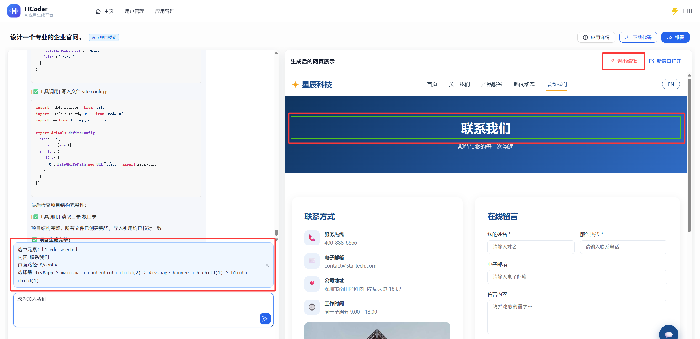

### 部署与访问

一键部署后返回带 deployKey 的访问链接：

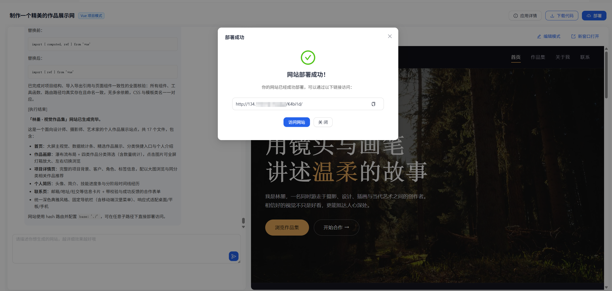

通过部署地址直接访问生成的网站：

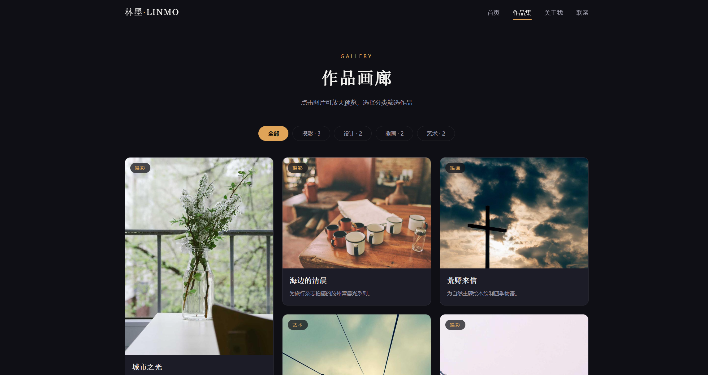

### 应用与后台管理

应用信息编辑，根据角色区分可编辑字段：

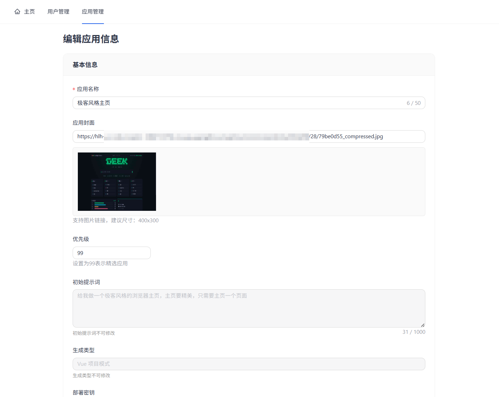

管理员应用管理，支持封面预览与精选标记一键切换：

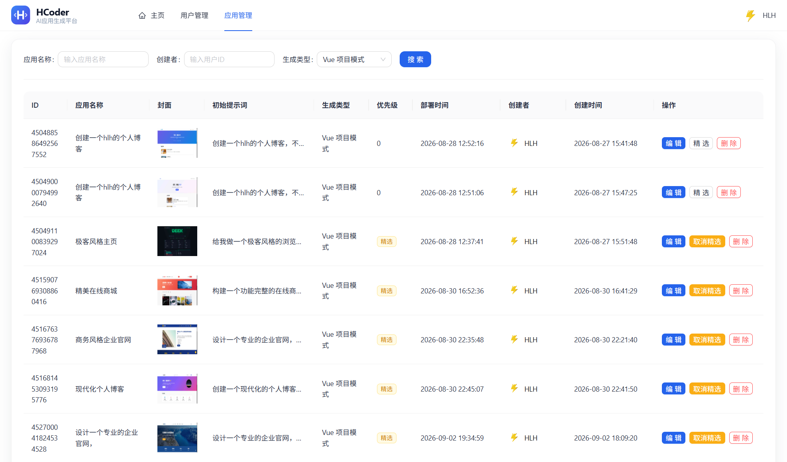

管理员用户管理：

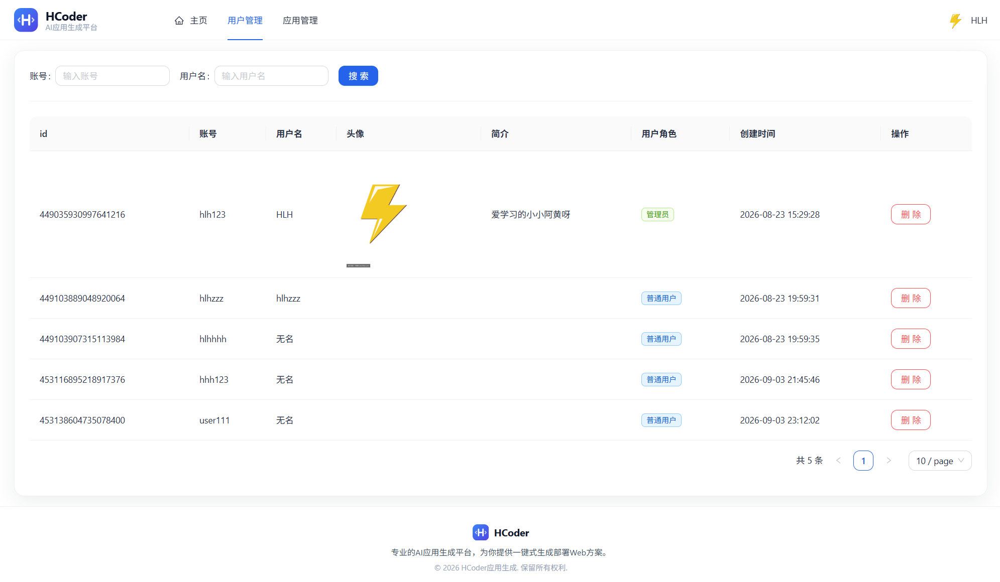

---

## Roadmap

- [ ] **LangGraph4j 工作流接入主链路**：把 `CodeGeneratorNode` 中固定的 `appId = 1000L` 改为真实应用 ID，并把工作流上下文与 `chat_history` 打通
- [ ] **双模式切换**：前端支持「标准模式（LangChain4j）/ 工作流模式（LangGraph4j）」一键切换，并展示工作流节点级进度与素材收集结果
- [ ] **上下文压缩机制**：长对话场景下对旧工具结果做微压缩与 LLM 摘要压缩，控制 token 消耗
- [ ] **云端部署**：以对象存储 + CDN 替代本地静态目录部署，支持自定义域名
- [ ] **质检能力下沉**：把工作流的 AI 质检 + 定向修复能力复用到 LangChain4j 主链路
- [ ] **微服务拆分**：按应用服务、用户服务、截图服务拆分，引入注册中心与服务调用
- [ ] **监控体系**：接入 AI 调用量、token 消耗、构建成功率等业务指标监控

---

## License

[MIT](LICENSE)

---

## Author

**hlh**

- GitHub：[Damon-HLH](https://github.com/Damon-HLH)

如果这个项目对你有帮助，欢迎点个 ⭐ Star 支持一下。
